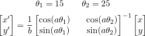
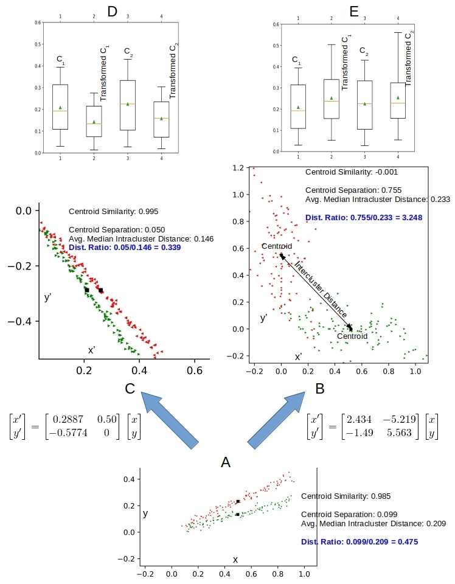

# Clustering-text-with-tranformed-document-vectors
Clustering Text with Transformed Document Vectors

This is the source code to go along with the blog article  

[Clustering Text with Transformed Document Vectors](http://xplordat.com/2018/11/05/want-clusters-how-many-will-you-have/)

## Dependencies

	numpy
	image
	matplotlib

## Usage

python ./transform.py b a

	1. b: A stretching factor
	2. a: A rotaton factor

The points in [x,y] space are transformed to [x',y'] space with:

## Impact of transformation on clustering

